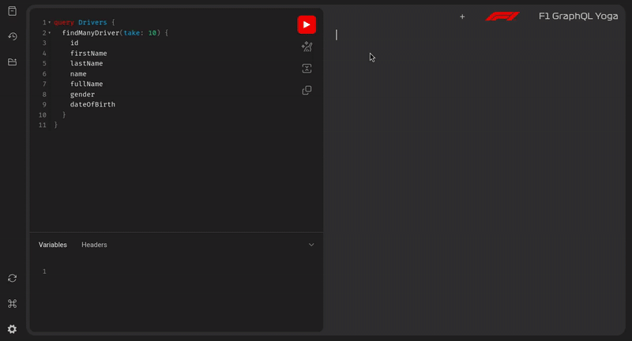

<div align="center">
  <a href="https://f1-graphql.davideladisa.it/" target="_blank"></a>
  <br/>
  <h1>
    <a href="https://f1-graphql.davideladisa.it/" target="_blank" style="text-decoration: none; color: inherit;">
      F1 GraphQL
    </a>
  </h1>
  <h3>The Ultimate GraphQL API for Formula 1 Data</h3>
  <p><i>All F1 history and statistics at your fingertips through GraphQL</i></p>
<!-- [](https://github.com/FrancoStino/f1-graphql/stargazers)
[](https://github.com/FrancoStino/f1-graphql/network/members)
[](https://github.com/FrancoStino/f1-graphql/commits/main)
[](https://github.com/FrancoStino/f1-graphql/issues) -->

[](https://opensource.org/licenses/MIT)
[](https://github.com/FrancoStino/F1-GraphQL/releases)
  </div>
<br/>

<!-- TOC start (generated with https://github.com/derlin/bitdowntoc) -->
## Table of Contents
- [✨ Features](#-features)
- [🎬 Demo](#-demo)
- [🏁 Quick Start](#-quick-start)
   * [Prerequisites](#prerequisites)
   * [Installation](#installation)
- [🌐 API Endpoints](#-api-endpoints)
- [📝 Example Queries](#-example-queries)
   * [Get first ten Drivers](#get-first-ten-drivers)
   * [Find Race Results for a Specific Grand Prix](#find-race-results-for-a-specific-grand-prix)
- [🛠️ Tech Stack](#-tech-stack)
- [📂 Project Structure](#-project-structure)
- [🔄 CI/CD Workflows](#-cicd-workflows)
- [📜 License](#-license)
- [👨‍💻 Author](#-author)
- [🏆 Acknowledgements](#-acknowledgements)

<!-- TOC end -->

<!-- TOC --><a name="-features"></a>
## ✨ Features

- **🚀 Dual GraphQL Engines** - Choose between Apollo Server and GraphQL Yoga interfaces
- **📊 Complete F1 Database** - Access comprehensive Formula 1 historical data
- **🔄 Automated Updates** - Database refreshed daily with the latest F1 statistics
- **⚡ High Performance** - Built on modern Node.js with TypeScript and Prisma ORM
- **🧩 Rich Query Options** - Filter, paginate, and explore F1 data with flexible queries

<!-- TOC --><a name="-demo"></a>
## 🎬 Demo
<div align="center">
  
  <p><i>Watch F1 GraphQL in action</i></p>
</div>

<!-- TOC --><a name="-quick-start"></a>
## 🏁 Quick Start

<!-- TOC --><a name="prerequisites"></a>
### Prerequisites

- Node.js (v22+)
- Yarn package manager
- PostgreSQL database

<!-- TOC --><a name="installation"></a>
### Installation

```bash
# Clone the repository
git clone git@github.com:FrancoStino/F1-GraphQL.git

# Navigate to the project directory
cd f1-graphql

# Install dependencies
yarn install

# Configure your environment
cp .env.example .env
# Edit .env with your database connection string

# Generate Prisma client
yarn build

# Start development server
yarn dev
```

<!-- TOC --><a name="-api-endpoints"></a>
## 🌐 API Endpoints

Once running, access your GraphQL API through:

| Endpoint | URL | Description |
|----------|-----|-------------|
| 🏠 **Landing Page** | `http://localhost:4000/` | Main welcome page with links |
| 🧪 **GraphQL Yoga** | `http://localhost:4000/graphql` | GraphiQL interface for testing |
| 🚀 **Apollo Server** | `http://localhost:4000/apollo` | Apollo Sandbox environment |

<!-- TOC --><a name="-example-queries"></a>
## 📝 Example Queries

<!-- TOC --><a name="get-first-ten-drivers"></a>
### Get first ten Drivers

```graphql
query Drivers {
  findManyDriver(take: 10) {
    id
    firstName
    lastName
    name
    fullName
    gender
    dateOfBirth
  }
}
```

<!-- TOC --><a name="find-race-results-for-a-specific-grand-prix"></a>
### Find Race Results for a Specific Grand Prix

```graphql
query Race {
  findManyRace(take: 50) {
    year
    turns
    laps
  }
}
```

<!-- TOC --><a name="-tech-stack"></a>
## 🛠️ Tech Stack

<table>
  <tr>
    <td align="center" width="96">
      <a href="https://gqloom.dev/" target="_blank">
        
        <br>GQLoom
      </a>
    </td>
    <td align="center" width="96">
      <a href="https://www.typescriptlang.org/" target="_blank">
        
        <br>TypeScript
      </a>
    </td>
    <td align="center" width="96">
      <a href="https://graphql.org/" target="_blank">
        
        <br>GraphQL
      </a>
    </td>
    <td align="center" width="96">
      <a href="https://www.prisma.io/" target="_blank">
        
        <br>Prisma
      </a>
    </td>
    <td align="center" width="96">
      <a href="https://www.apollographql.com/" target="_blank">
        
        <br>Apollo
      </a>
    </td>
    <td align="center" width="96">
      <a href="https://the-guild.dev/graphql/yoga-server" target="_blank">
        
        <br>Yoga
      </a>
    </td>
  </tr>
</table>


<!-- TOC --><a name="-project-structure"></a>
## 📂 Project Structure

```
f1-graphql/
├── .github/            # GitHub Actions workflows for CI/CD
├── assets/             # Static assets (images, CSS)
├── prisma/             # Database schema and generated client
├── src/
│   ├── providers/      # Database client provider
│   ├── resolvers/      # GraphQL resolvers configuration
│   ├── schema/         # GraphQL schema generation
│   ├── servers/        # Server configurations
│   │   ├── ApolloServer.ts
│   │   ├── Express.ts
│   │   ├── GraphQL-Yoga.ts
│   │   └── LandingPage.ts
│   ├── utils/          # Utility functions
│   └── index.ts        # Main entry point
```

<!-- TOC --><a name="-cicd-workflows"></a>
## 🔄 CI/CD Workflows

This project uses GitHub Actions for:

- **Daily Data Updates**: Automatically refreshes the F1 database
- **Release Management**: Generates changelogs and tags
- **Branch Syncing**: Keeps development branches in sync

<!-- TOC --><a name="-license"></a>
## 📜 License

This project is licensed under the MIT License.

<!-- TOC --><a name="-author"></a>
## 👨‍💻 Author

**Davide Ladisa**

<!-- TOC --><a name="-acknowledgements"></a>
## 🏆 Acknowledgements

- [F1DB](https://github.com/f1db/f1db) - The comprehensive Formula 1 database
- [GQLoom](https://gqloom.dev/) - GraphQL tooling that powers our schema

---

<div align="center">
  <p>🏎️ <b>Ready to race with F1 data?</b> Star this repo and buckle up! 🏁</p>
</div>
